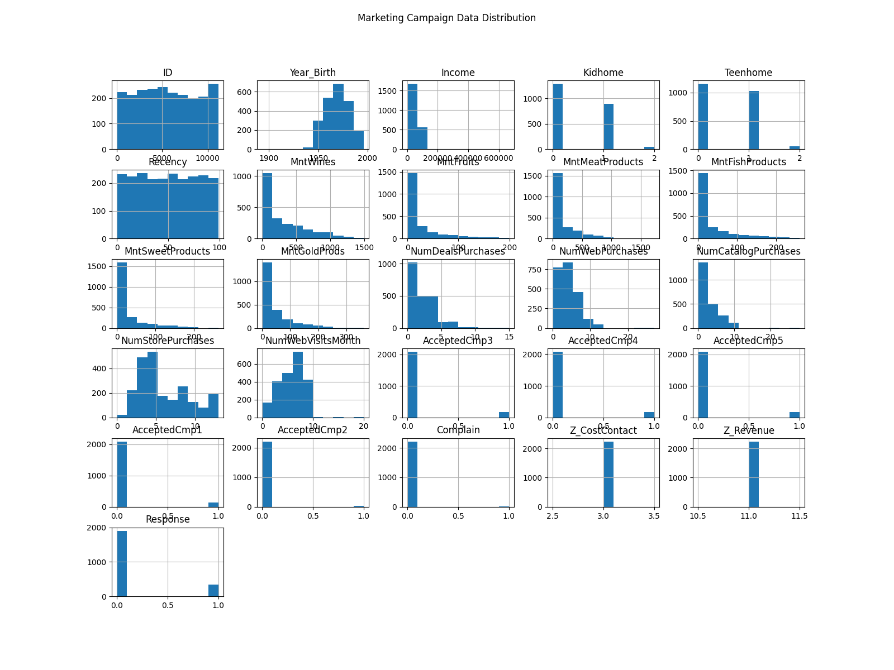
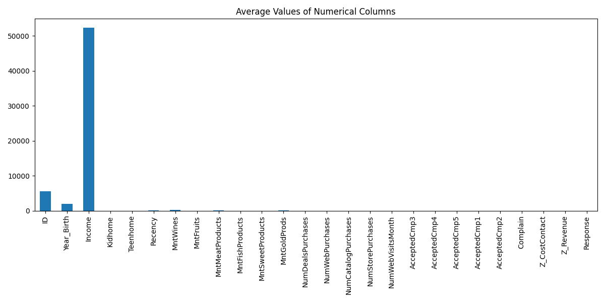
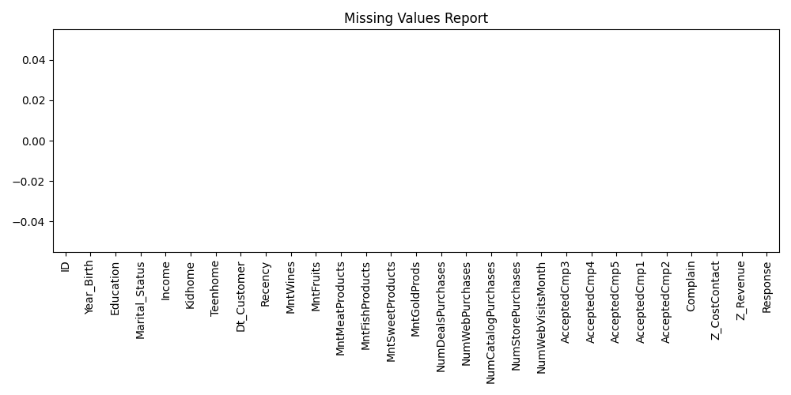

# Data Cleaning & Reporting Automation

## Overview
This project demonstrates an automated data cleaning and reporting system using Python. The project processes raw marketing campaign data, handles missing values, removes duplicates, generates summary reports, performs correlation analysis, and creates automated visual summaries.

The automation workflow improves data preprocessing efficiency and helps generate meaningful insights from the dataset.

---

## Technologies Used
- Python
- Pandas
- NumPy
- Matplotlib
- Google Colab

---

## Features
- Automated Data Cleaning
- Missing Value Handling
- Duplicate Removal
- Automated Summary Report Generation
- Correlation Analysis
- Visual Summary Generation
- Export of Cleaned Dataset

---

## Generated Reports
- Cleaned Dataset CSV
- Summary Statistics Report
- Correlation Analysis Report
- Automated Text Report
- Visualization Charts

---

# Output Visualizations

## Histogram Visualization



---

## Bar Chart Summary



---

## Missing Values Report



---

# Requirements

Install required libraries using:

```bash
pip install -r requirements.txt
```

## requirements.txt

```text
pandas
numpy
matplotlib
```

---

# How to Run

1. Upload the dataset file
2. Run the notebook in Google Colab or Jupyter Notebook
3. Generated reports and visualizations will be saved automatically

---

# Future Improvements
- Add interactive dashboards
- Integrate Power BI reporting
- Automate email report delivery
- Use advanced analytics techniques

---

# Author
## Gowtham N
